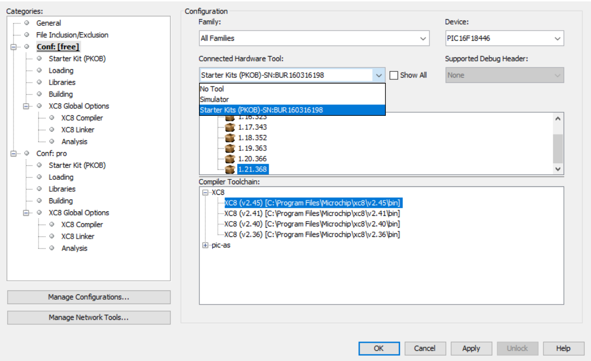

# Sensor Board Proximity Measurement

The PIC16F184xx family has a new Analog to Digital Converter with Computation (ADCC) with a 12-bit resolution. This project shows the reading of a proximity sensor using the ADCC. The sensor is made of a PCB trace on the board perimeter. The proximity sensor is used to detect human activity around the device. If no activity is detected for some time, the display backlight turns OFF, and turns back ON if the user approaches the hand.

In this example the PIC16F18446 Sensor Board is used. The demo has 2 operating modes:
1. A dynamic interpretation of the user’s hand distance to the sensor is displayed on the LCD;
2. The buzzer is generating a variable pitch tone, according to the user's hand distance. The PIC reads the proximity sensor, using the ADCC with Capacitive Voltage Division (CVD).

## Related Documentation
- [PIC16F18446 Product Family Page](https://www.microchip.com/design-centers/8-bit/pic-mcus/device-selection/pic16f18446)
- [PIC16F18446 datasheet](http://ww1.microchip.com/downloads/en/DeviceDoc/40001985B.pdf) for more information or specifications.

## Software Used

- [MPLAB® X IDE](http://www.microchip.com/mplab/mplab-x-ide) v6.15 or newer
- [MPLAB® XC8](http://www.microchip.com/mplab/compilers) v2.45 or newer
- [MPLAB® Code Configurator (MCC)](microchip.com/mplab/mplab-code-configurator) v5.3.7
- [PIC16F1xxxx_DFP](https://packs.download.microchip.com/) v1.21.368

## Hardware Used

- [PIC16F18446 Sensor Board Demonstration](https://www.microchip.com/promo/pic16f18446-sensor-board-demonstration)
 

## Operation

To program the microcontroller with this MPLAB X project, follow the steps provided in the [How to Program the Microcontroller](#how-to-program-the-microcontroller) chapter.  

## Setup

The following configurations must be made for this project:

- Clock Control:
  - Clock Source: HFINTOSC
  - HF Internal Clock: 32 MHz
  - Clock Divider: 1

   

- Configuration bits:
  - External Oscillator Selection: Oscillator not enabled
  - Reset Oscillator Selection: HFINTOSC (1MHz)

   

- MSSP:
  - Serial Protocol: SPI
  - Mode: Host
  - SPI Mode: SPI Mode 0
  - Input Data Sampled At: Middle
  - Clock Source Selection: FOSC/4 

   

- CLC:
  - Enable CLC: Yes
  - Operating Mode: AND-OR 

   
   

- FVR:
 FVR is used as positive refference for the ADCC, to get higher accuracy and gain.
  - Enable FVR: Yes
  - FVR buffer gain to ADC: 1x
  - FVR buffer gain to other peripherals: 1x

   

- ADCC:
  - Enable ADC: Yes
  - Operating Mode: Burst_average_mode
  - Result Alignment: Right
  - Positive Input Channel: ANA0
  - Positive Reference: FVR
  - Negative Reference: VSS
  - Auto-conversion Trigger: Disabled
  - Acquisition Count: 0
  - Clock Source: FOSC
  - Clock Divider: FOSC/128
  - Repeat: 64

   
   

- CCP1:
 CCP1 is used for generating the buzzer tone.
  - Enable CCP: Yes
  - CCP Mode: Compare
  - Select Timer: Timer 1
  - Mode: Toggle_cleartmr

   

- CCP2:
 CCP2 is used for generating the PWM for the LCD Backlight.
  - Enable CCP: Yes
  - CCP Mode: PWM
  - Select Timer: Timer 2
  - Duty Cycle (%): 0
  - CCPR Alignment: right_aligned

   

- CWG:
 CWG is used to output the signal from CCP1 in antiphase on 2 pins, so that the buzzer sounds louder.
  - Enable CWG: Yes
  - Input Source: CCP1_OUT
  - Output Mode: Half bridge mode
  - Clock Source: FOSC

   

- TMR1:
 TMR1 is used to clock the CCP1. It sets the pitch of the buzzer tone.
  - Enable Timer: Yes
  - Clock Source: FOSC/4
  - Prescaler: 1:4
  - External Clock Input Sync: synchronize
  - Timer Period (s): 0.0327675

   

- TMR2:
 TMR2 is used to clock the CCP2 for the LCD Backlight PWM, and also as a timebase for the proximity activity time measurement.
  - Enable Timer: Yes
  - Control Mode: Role over pulse
  - Start/Reset Option: Software control 
  - Clock Source: FOSC/4
  - Prescaler: 1:128
  - Postscaler: 1:8
  - Timer Period (s): 0.01
  - TMR Interrupt Enable: Yes

   

- PIN_Grid
   

- PIN_Module
   

## Demo

Board setup:

   

## Summary

This code exemple shows the reading of a proximity sensor using the ADCC peripheral.

## How to Program the Microcontroller

This chapter demonstrates how to use the MPLAB X IDE to program a PIC® device with an `Example_Project.X`. This applies to other projects.

1.  Connect the Curiosity Development board to the PC.

2.  Open the `Example_Project.X` project in MPLAB X IDE.

3.  Set the `Example_Project.X` project as main project.
     Right click the project in the **Projects** tab and then Set as Main Project.
     

4.  Clean and build the `Example_Project.X` project.
     Right click the `Example_Project.X` project and select Clean and Build.
     

5.  Select Starter Kits (PKOB) in the Connected Hardware Tool section of the project settings:
     Right click the project and **Properties**.
     Click the arrow under the Connected Hardware Tool, and from the dropdown, select Starter Kits (PKOB) by clicking the SN.
     Click **Apply** and then **OK**.
     

6.  Program the project to the microcontroller.
     Right click the project and then Make and Program Device.
     

 

- [Back to Top](#sensor-board-proximity-measurement)
- [Back to Setup](#setup)
- [Back to Demo](#demo)
- [Back to Summary](#summary)