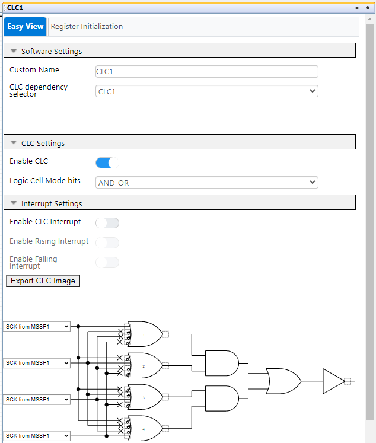
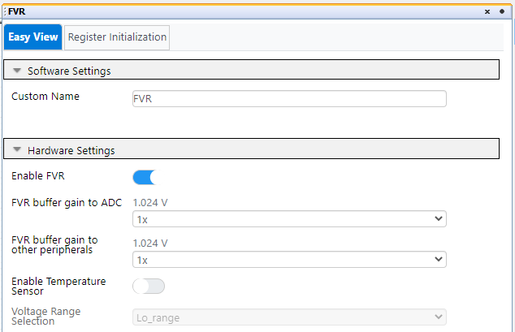
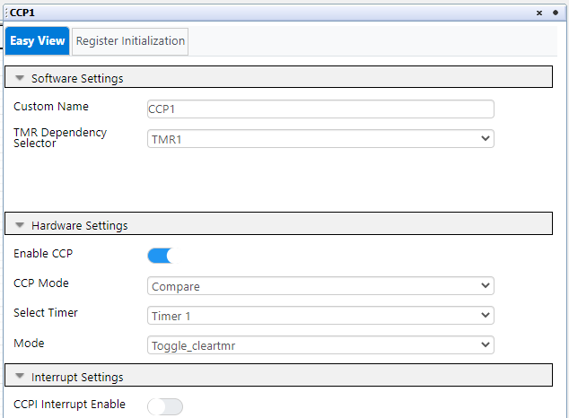

# Sensor Board Proximity Measurement

The PIC16F184xx family has a new Analog to Digital Converter with Computation (ADCC) with a 12-bit resolution. This project shows the reading of a proximity sensor using the ADCC. The sensor is made of a PCB trace on the board perimeter. The proximity sensor is used to detect human activity around the device. If no activity is detected for some time, the display backlight turns OFF, and turns back ON if the user approaches the hand.

In this example the PIC16F18446 Sensor Board is used. The demo has 2 operating modes:
1. A dynamic interpretation of the user’s hand distance to the sensor is displayed on the LCD;
2. The buzzer is generating a variable pitch tone, according to the user's hand distance. The PIC reads the proximity sensor, using the ADCC with Capacitive Voltage Division (CVD).

## Related Documentation
- [PIC16F18446 Product Family Page](https://www.microchip.com/design-centers/8-bit/pic-mcus/device-selection/pic16f18446)
- [PIC16F18446 datasheet](http://ww1.microchip.com/downloads/en/DeviceDoc/40001985B.pdf) for more information or specifications.

## Software Used
- MPLAB® X IDE 5.30 or newer [(microchip.com/mplab/mplab-x-ide)](http://www.microchip.com/mplab/mplab-x-ide)
- MPLAB® XC8 2.10 or a newer compiler [(microchip.com/mplab/compilers)](http://www.microchip.com/mplab/compilers)
- MPLAB® Code Configurator (MCC) 3.95.0 or newer [(microchip.com/mplab/mplab-code-configurator)](https://www.microchip.com/mplab/mplab-code-configurator)
- MPLAB® Code Configurator (MCC) Device Libraries 8-bit AVR MCUs 2.3.0 or newer [(microchip.com/mplab/mplab-code-configurator)](https://www.microchip.com/mplab/mplab-code-configurator)
- PIC16F1xxxx DFP 1.2.99 or newer Device Pack

## Hardware Used
- [PIC16F18446 Sensor Board Demonstration](https://www.microchip.com/promo/pic16f18446-sensor-board-demonstration)

## Setup

### MCC Settings
Here are the settings used for MSSP, CLC, FVR, ADCC, CCP, CWG, TMR1 and TMR2. MSSP + CLC are used for the LCD control.

### MSSP Settings

 

### CCL Settings

 

 

### FVR Settings
FVR is used as positive refference for the ADCC, to get higher accuracy and gain.

 

### ADCC settings

 

ADRPT register is set to 0x40, to average a burst of 64 samples.

 

### CCP Settings
CCP1 is used for generating the buzzer tone.

 

CCP2 is used for generating the PWM for the LCD Backlight.

 

### CWG Settings
CWG is used to output the signal from CCP1 in antiphase on 2 pins, so that the buzzer sounds louder.

 

### TMR Settings
TMR1 is used to clock the CCP1. It sets the pitch of the buzzer tone.

 

TMR2 is used to clock the CCP2 for the LCD Backlight PWM, and also as a timebase for the proximity activity time measurement.

 

### PIN Grid

 

### PIN Module

 

