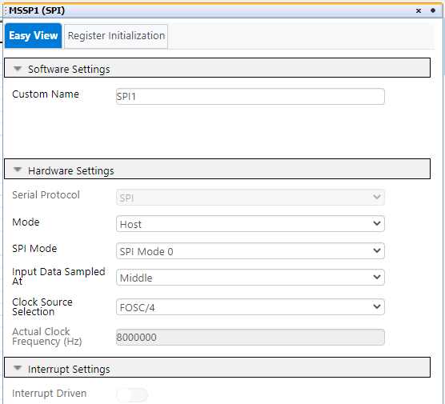

  <article class="markdown-body entry-content p-3 p-md-6" itemprop="text">

# Introduction
The PIC16F184xx family has a new Analog to Digital Converter with Computation (ADCC) with a 12-bit resolution. This project shows the reading of a proximity sensor using the ADCC. The sensor is made of a PCB trace on the board perimeter. The proximity sensor is used to detect human activity around the device. If no activity is detected for some time, the display backlight turns OFF, and turns back ON if the user approaches the hand.

# Description
In this example we will be using the PIC16F18446 Sensor Board. The demo has 2 operating modes: In the first mode, a dynamic interpretation of the user’s hand distance to the sensor is displayed on the LCD, and in the second mode, the buzzer is generating a variable pitch tone, according to the user's hand distance. The PIC reads the proximity sensor, using the ADCC with Capacitive Voltage Division (CVD).

# MCC Settings
Here are the settings used for MSSP, CLC, FVR, ADCC, CCP, CWG, TMR1 and TMR2. MSSP + CLC are used for the LCD control.

### MSSP Settings

### CCL Settings

### FVR Settings
FVR is used as positive refference for the ADCC, to get higher accuracy and gain.

### ADCC settings

ADRPT register is set to 0x40, to average a burst of 64 samples.

### CCP Settings
CCP1 is used for generating the buzzer tone.

CCP2 is used for generating the PWM for the LCD Backlight.

### CWG Settings
CWG is used to output the signal from CCP1 in antiphase on 2 pins, so that the buzzer sounds louder.

### TMR Settings
TMR1 is used to clock the CCP1. It sets the pitch of the buzzer tone.

TMR2 is used to clock the CCP2 for the LCD Backlight PWM, and also as a timebase for the proximity activity time measurement.

### PIN Grid

### PIN Module

